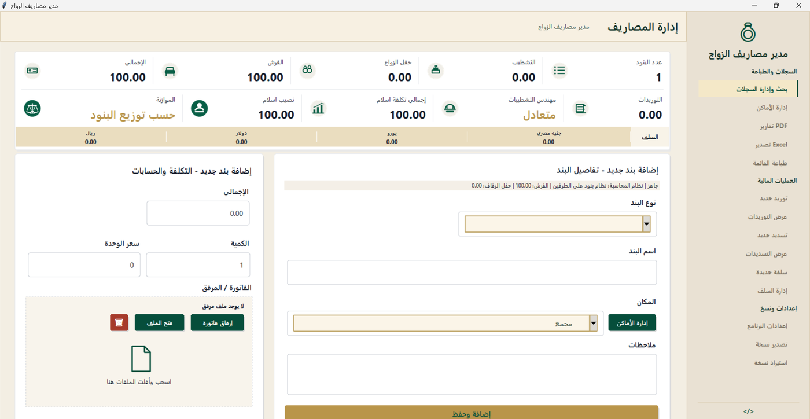
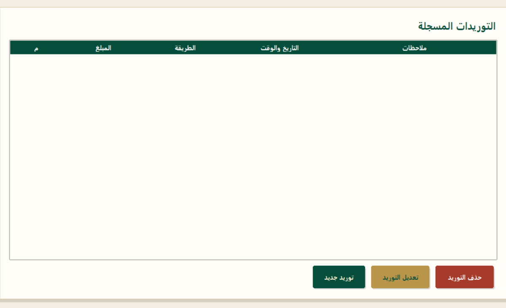
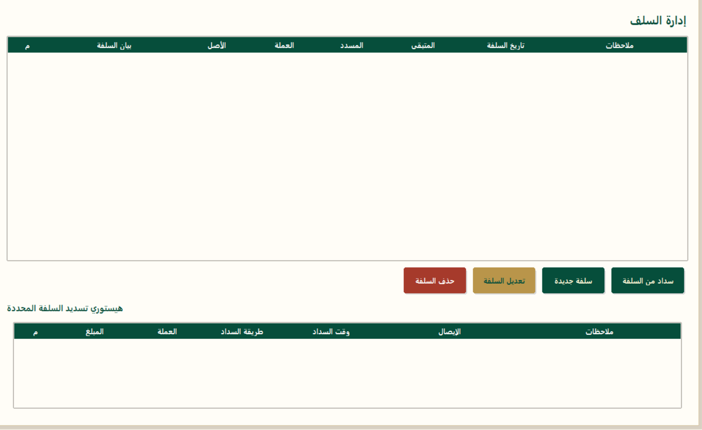

<div dir="rtl" align="right">

# مدير مصاريف الزواج

تطبيق سطح مكتب عربي لإدارة مصاريف تجهيز الشقة والزواج. يحفظ البرنامج البيانات محليا على جهاز المستخدم، ويدعم البنود، الفواتير، التوريدات، التسديدات، السلف، التقارير، والنسخ الاحتياطي.

</div>

<p align="center">
  
  
  
  
</p>

<div dir="rtl" align="right">

## التحميل والتشغيل

لو أنت مستخدم عادي، لا تحتاج إلى تثبيت Python أو أي مكتبات برمجية. حمّل النسخة الجاهزة من صفحة:

[GitHub Releases](https://github.com/Abouels/Marriage_Manager/releases)

كل إصدار رسمي يوفر اختيارات جاهزة حسب نظام التشغيل:

| الملف | مناسب لمن؟ | طريقة التشغيل |
| --- | --- | --- |
| `MarriageExpensesManager_Setup_*.exe` | تثبيت عادي على Windows | افتح ملف التثبيت واتبع الخطوات |
| `MarriageExpensesManager_Portable_*.zip` | نسخة محمولة بدون تثبيت | فك الضغط ثم افتح `MarriageExpensesManager.exe` |
| `MarriageExpensesManager_macOS_*.zip` | تشغيل على macOS | فك الضغط ثم افتح `MarriageExpensesManager.app` |

بيانات نسخة التثبيت تحفظ داخل:

```text
%LOCALAPPDATA%\MarriageExpensesManager\app_data
```

بيانات النسخة المحمولة تحفظ داخل مجلد `app_data` بجانب ملف التشغيل.

## المميزات

| القسم | الوصف |
| --- | --- |
| المصاريف | تسجيل بنود الفرش، التشطيب، حفل الزفاف، والمصاريف الأخرى |
| الحسابات | دعم نظام الطرف الواحد، 50/50، أو تحديد الطرف المسؤول لكل بند |
| المرفقات | إرفاق صور أو ملفات PDF للفواتير والإيصالات |
| التوريدات | تسجيل المبالغ المستلمة وطريقة الدفع والتاريخ والملاحظات |
| التسديدات | متابعة المدفوعات لجهات الدفع المختلفة |
| السلف | تسجيل السلف بعملات متعددة ومتابعة المسدد والمتبقي |
| التقارير | تصدير Excel وتقارير PDF |
| النسخ الاحتياطي | تصدير واستيراد نسخة احتياطية آمنة من بيانات البرنامج |
| الدعم | إرسال بلاغات دعم عند تفعيل رابط الاستقبال الخاص |

## لقطات من الواجهة

<p align="center">
  
</p>

<table>
  <tr>
    <td align="center">
      <strong>عرض التوريدات</strong><br>
      
    </td>
    <td align="center">
      <strong>إدارة السلف</strong><br>
      
    </td>
  </tr>
</table>

## للمطورين

ثبت المتطلبات:

```powershell
py -m pip install -r requirements.txt
```

شغّل البرنامج أثناء التطوير:

```powershell
py app.py
```

أو شغله بدون نافذة Console على Windows:

```powershell
py app.pyw
```

شغّل فحوصات التحقق:

```powershell
py -m py_compile app.py app.pyw
py -m unittest discover -s tests
```

## البناء

لبناء نسخة Portable محليا:

```powershell
.\build_portable.ps1
```

لبناء Installer بعد بناء النسخة المحمولة:

```powershell
.\build_installer.ps1 -Version "1.0.0"
```

لو أردت تفعيل الدعم في النسخة المبنية، اقرأ [SUPPORT_SETUP.md](SUPPORT_SETUP.md) واضبط المتغير `MARRIAGE_MANAGER_SUPPORT_URL` قبل البناء.

## هيكل المشروع

```text
apartment_manager/
|-- app.py                         # التطبيق الأساسي والمنطق والواجهة
|-- app.pyw                        # Launcher صامت على Windows
|-- requirements.txt               # متطلبات التشغيل والتطوير المثبتة بإصدارات محددة
|-- requirements-build.txt         # متطلبات البناء
|-- build_portable.ps1             # بناء نسخة Portable
|-- build_installer.ps1            # بناء Installer
|-- packaging/
|   |-- MarriageExpensesManager.spec
|   `-- MarriageExpensesManager.iss
|-- .github/workflows/
|   |-- ci.yml
|   |-- release-windows.yml
|   `-- release-macos.yml
|-- tests/
|-- assets/
|   |-- icons/
|   `-- screenshots/
`-- app_data/                      # بيانات محلية غير مرفوعة على GitHub
```

## ملاحظات أمنية

- لا ترفع `app_data` أو `support_endpoint.txt` إلى GitHub.
- استيراد النسخ الاحتياطية يفك الضغط داخل مجلد آمن فقط ويمنع مسارات الخروج من `app_data`.
- المرفقات الجديدة محصورة في الصور وPDF وبحد أقصى 100MB لكل ملف.
- روابط الدعم يجب أن تكون Google Apps Script HTTPS من الشكل `https://script.google.com/macros/s/.../exec`.

## صاحب المشروع

Designed & Developed by Eng. I. Abouelsaad  
i.abouelsaad9@gmail.com

</div>
